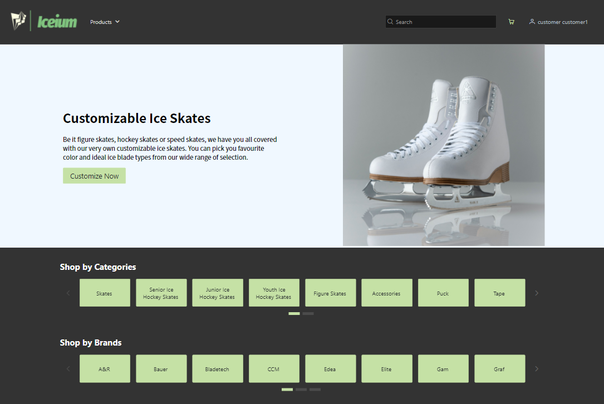
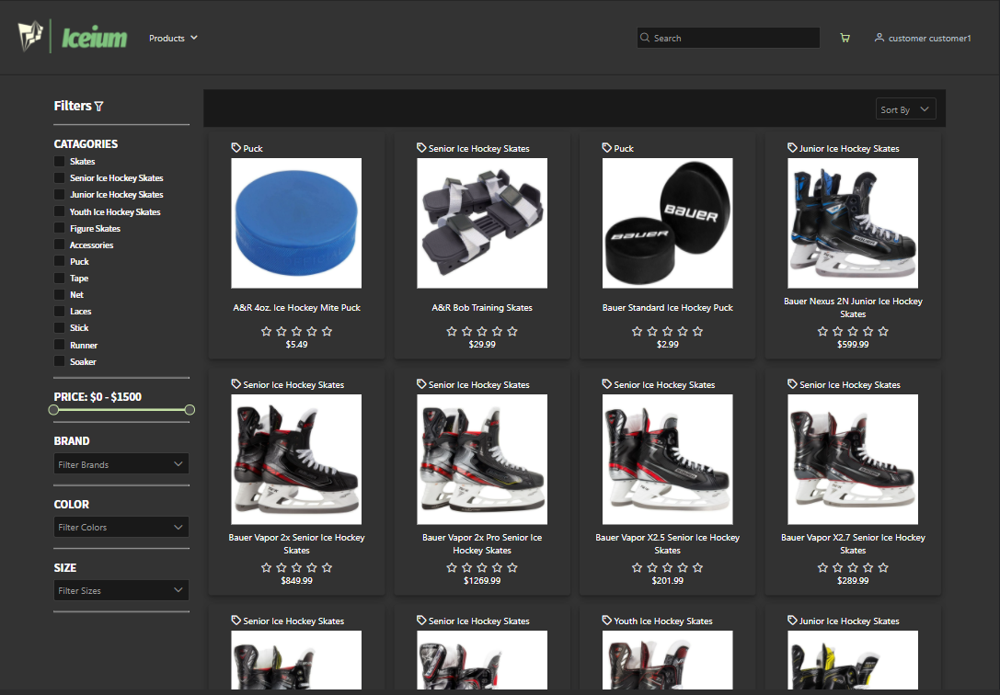
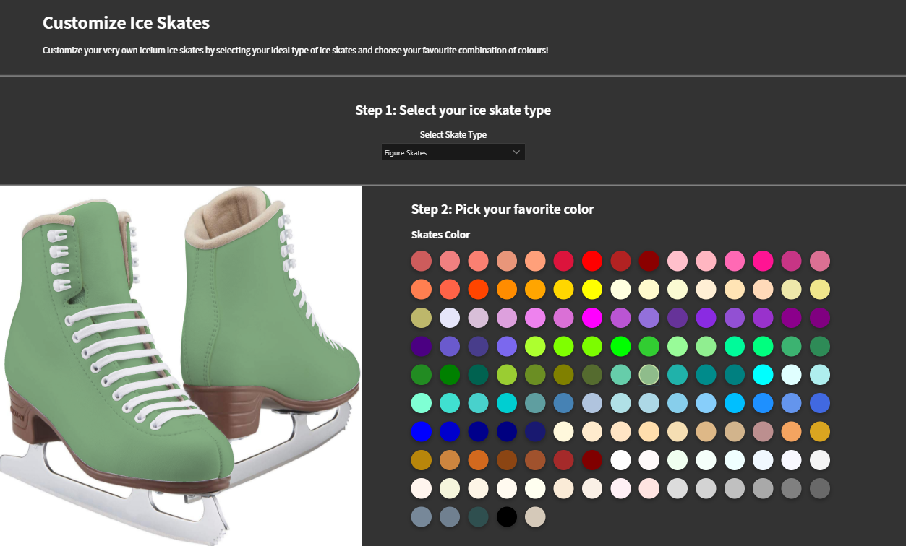
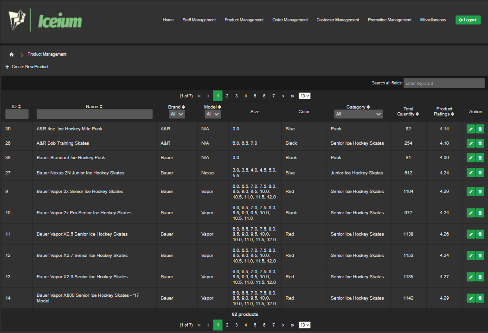

# Iceium ⛸️❄️
### _National University of Singapore - IS3106 Independent Software Development Project (Orbital) 2020_

Iceium is an ice skating products e-commerce platform. We are targeting the sports retail business domain, specifically the ice skating industry. Since the ice skating scene is rather non-existent in Singapore, there are hardly any physical shops retailing ice skating products and accessories. Iceium is here to help fill in the gap by providing locals with a venue to purchase ice skating products and obtain services related to ice skates customization.

The application consists of 2 front-ends using both server-side (JSF) and client-side (Angular) processing, along with a common backend built with Java EE using EJB, JPA and MySQL.

This application was written for NUS IS3106 Independent Software Development Project (Orbital) 2020.

## Table of Content :scroll:
* [Tech-stack](#tech-stack-computer)
* [Links](#links-link)
* [Screenshots](#screenshots-camera)
* [The Team](#the-team-man_technologist-woman_technologist)

## Tech-stack :computer:
* Angular
* PrimeNG
* JavaServer Faces (JSF)
* PrimeFaces
* Java EE 
* Enterprise JavaBean (EJB)
* Java Persistence API (JPA)
* MySQL

## Links :link:
View our demo video here: https://youtu.be/mESSdpg9Idc

## Screenshots :camera:
### Customer website (Angular)

#### Home:

#### Catalogue:

#### Customize Skates:

### Internal website (JSF)

#### Product Management

## The Team :man_technologist: :woman_technologist:
* [Mok Xiao Fan](https://github.com/chowzzzz)
* [Theodoric Keith Lim](https://github.com/cowturtle)
* [Hilary Mah Xin Yi](https://github.com/hilarymah)
* [Goh Chang Wei, Levron](https://github.com/Pomegrantooo)
